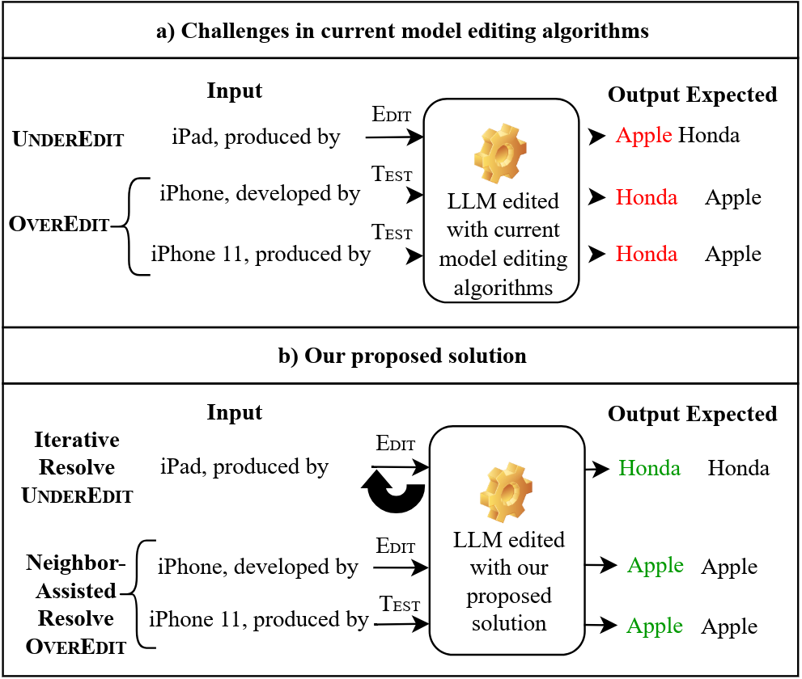

# [Resolving UnderEdit & OverEdit with Iterative & Neighbor-Assisted Model Editing](https://arxiv.org/abs/2503.11895)

**Official implementation** (Accepted at EMNLP 2025 Findings)



This repository provides the implementation of iterative and neighbor-assisted model editing for large language models with a simple CLI to reproduce experiments and run your own edits.

## Setup

### Prerequisites

This project uses `uv` for dependency management. If you don't have `uv` installed, please follow the installation instructions at:
- **Official uv documentation**: https://docs.astral.sh/uv/getting-started/installation/

### Installation

1. Clone the repository:
```bash
git clone https://github.com/bhimanbaghel/ResolveUnderOverEdit.git
cd ResolveUnderOverEdit
```

2. Install dependencies using `uv`:
```bash
uv sync
```

This command will:
- Create a virtual environment (`.venv`)
- Install all dependencies with exact versions from `uv.lock`

## Running Iterative Model Editing

### Command Template

```bash
python3 checkZ.py \
  --alg_name={ALGORITHM}_RECURSIVE \
  --model_name={MODEL} \
  --hparams_fname={HPARAMS_PATH} \
  --ds_name={DATASET} \
  --num_edits={NUM_EDITS} \
  --ds_subset={SUBSET_INDEX} \
  --iterations={ITERATIONS}
```

### Parameters

- **ALGORITHM**: Base editing algorithm name
  - Supported: `MEMIT`, `AlphaEdit`, `PMET`, `ROME`
  - Note: `_RECURSIVE` suffix is automatically added

- **MODEL**: Model identifier
  - Supported models: `gpt2-xl`, `gpt-j-6b`, `llama-2-7b`, `llama-3-8b`
  - Models should be downloaded from Hugging Face and placed in the `hugging_cache/` directory

- **HPARAMS_PATH**: Path to hyperparameter configuration file (YAML)
  - Example: `./hparams/MEMIT_RECURSIVE/llama3-8b.yaml`
  - Ensure the YAML matches your chosen model and algorithm

- **DATASET**: Dataset for editing
  - Supported datasets: `mcf`, `zsre`

- **NUM_EDITS**: Number of edits to apply (e.g., `1000`)

- **SUBSET_INDEX**: Dataset subset index (integer, e.g., `1`)
  - Results reported in the paper use subsets `1`, `10`, `15` for MCF dataset
  - Results reported in the paper use subsets `0`, `10`, `15` for ZSRE dataset

- **ITERATIONS**: Number of iterative editing passes
  - The code will run for the specified number of iterations
  - Note: Early stopping based on perplexity will not execute to show the full trend for experimentation

### Example

```bash
python3 checkZ.py --alg_name=MEMIT_RECURSIVE \
  --model_name=llama-3-8b \
  --hparams_fname=./hparams/MEMIT_RECURSIVE/llama3-8b.yaml \
  --ds_name=mcf \
  --num_edits=1000 \
  --ds_subset=1 \
  --iterations=5
```

## Running Neighbor-Assisted Model Editing

Neighbor-assisted model editing incorporates neighboring knowledge during the editing process to reduce OverEdit. Use the `_NEIGHBOR` suffix with your algorithm to enable this mode.

### Examples

**MEMIT with GPT-J-6B:**
```bash
python3 checkZ.py --alg_name=MEMIT_RECURSIVE_NEIGHBOR --model_name=gpt-j-6B --hparams_fname=./hparams/MEMIT_RECURSIVE_NEIGHBOR/gpt-j-6B.yaml --ds_name=mcf --num_edits=960 --ds_subset=960 --iterations=5
```

**MEMIT with GPT2-XL:**
```bash
python3 checkZ.py --alg_name=MEMIT_RECURSIVE_NEIGHBOR --model_name=gpt2-xl --hparams_fname=./hparams/MEMIT_RECURSIVE_NEIGHBOR/gpt2-xl.yaml --ds_name=mcf --num_edits=739 --ds_subset=739 --iterations=5
```

**PMET with Llama-2-7B:**
```bash
python3 checkZ.py --alg_name=PMET_RECURSIVE_NEIGHBOR --model_name=llama-2-7b --hparams_fname=./hparams/PMET_RECURSIVE_NEIGHBOR/llama-7b.yaml --ds_name=mcf --num_edits=1340 --ds_subset=1340 --iterations=5
```

### Important Notes

- **Do not change `--num_edits` and `--ds_subset` values**: These parameters are tied to the specific model and represent precomputed eligible examples for that model. Each model has its own set of eligible examples.

- **Using a different model**: If you choose a model other than the ones in the examples above, the eligible examples need to be recomputed for that model. The algorithms can be changed (e.g., from MEMIT to PMET), but the num_edits and ds_subset should match the model's precomputed values.

- **Iterative vs. Neighbor-Assisted**: The commands shown above run the **iterative version of neighbor-assisted model editing**. Our paper provides comparative results between:
  - **Iterative Model Editing**: Reduces UnderEdit
  - **Iterative + Neighbor-Assisted Model Editing**: Reduces both UnderEdit and OverEdit

- **To run only iterative editing** (without neighbor assistance): Simply remove the `_NEIGHBOR` suffix from the algorithm name and keep all other parameters the same. For example:
  ```bash
  # Iterative only (no neighbor assistance)
  python3 checkZ.py --alg_name=MEMIT_RECURSIVE --model_name=gpt-j-6B --hparams_fname=./hparams/MEMIT_RECURSIVE/gpt-j-6B.yaml --ds_name=mcf --num_edits=960 --ds_subset=960 --iterations=5
  ```

## Repository

- GitHub: https://github.com/bhimanbaghel/ResolveUnderOverEdit

## Citation

If you use this code in your research, please cite our paper:

```bibtex
@misc{baghel2025resolvingundereditoveredit,
      title={Resolving UnderEdit & OverEdit with Iterative & Neighbor-Assisted Model Editing}, 
      author={Bhiman Kumar Baghel and Emma Jordan and Zheyuan Ryan Shi and Xiang Lorraine Li},
      year={2025},
      eprint={2503.11895},
      archivePrefix={arXiv},
      primaryClass={cs.CL},
      url={https://arxiv.org/abs/2503.11895}, 
}
```

## Acknowledgments

This work builds upon the [EasyEdit](https://github.com/zjunlp/EasyEdit) framework. We extend our sincere gratitude to the EasyEdit authors for their excellent work and open-source contribution. If you use this code, please also consider citing their work:

```bibtex
@article{wang2023easyedit,
  title={Easyedit: An easy-to-use knowledge editing framework for large language models},
  author={Wang, Peng and Zhang, Ningyu and Xie, Xin and Yao, Yunzhi and Tian, Bozhong and Wang, Mengru and Xi, Zekun and Cheng, Siyuan and Liu, Kangwei and Zheng, Guozhou and others},
  journal={arXiv preprint arXiv:2308.07269},
  year={2023}
}
```
